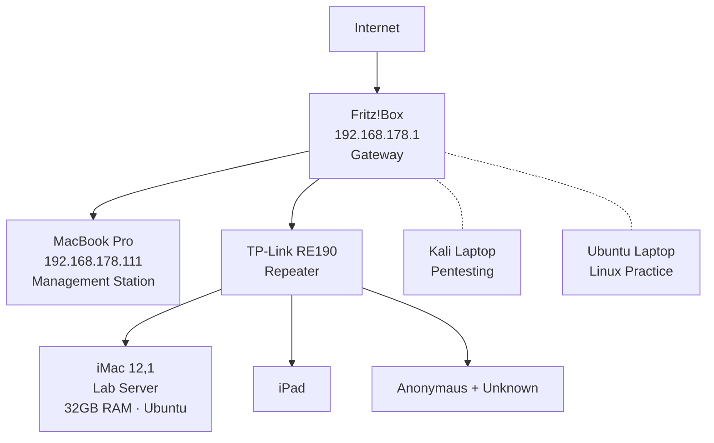

# Lab 0: Network Discovery & Port Analysis

## Objective
Discover all devices on my home network, map the topology, scan for open ports, and perform a basic security assessment using command-line tools.

## Tools Used
- ifconfig (macOS network configuration)
- ip addr show (Linux network configuration)
- arp -a (ARP table inspection)
- ping / broadcast ping
- netstat (routing table)
- nmap -sn (host discovery)
- nmap -sV (service version detection)
- ufw status (firewall check)

## Date
March 12, 2026

## Network Overview
- **Network:** 192.168.178.0/24
- **Subnet Mask:** 255.255.255.0
- **Gateway:** 192.168.178.1 (Fritz!Box by AVM)
- **DHCP:** Enabled (assigned by Fritz!Box)

## Phase 1: Device Discovery

### Method 1 — ARP Table (arp -a)
Initial scan showed multiple devices sharing the same MAC address (9A:03:8E:02:C8:DC). This was suspicious and required further investigation.

### Method 2 — Broadcast Ping
Broadcast ping to 192.168.178.255 forced all devices to respond, revealing hostnames that were not visible in the initial ARP scan. This identified the TP-Link RE190 Wi-Fi Repeater as the source of the shared MAC address.

### Method 3 — Nmap Host Discovery (nmap -sn)
Full subnet scan confirmed 7 active hosts.

**Discovered Devices:**

| Device | IP Address | MAC Address | Connection |
|--------|-----------|-------------|------------|
| Fritz!Box | 192.168.178.1 | 38:10:D5:D8:33:B7 (AVM) | Direct — Gateway |
| MacBook Pro | 192.168.178.111 | 7a:7d:0f:d3:1b:78 | Direct to Fritz!Box |
| TP-Link RE190 | 192.168.178.80 | 9A:03:8E:02:C8:DC | Direct to Fritz!Box |
| iMac 12,1 | 192.168.178.78 | via Repeater | Through RE190 |
| iPad | 192.168.178.106 | via Repeater | Through RE190 |
| Anonymaus | 192.168.178.112 | via Repeater | Through RE190 |
| Unknown | 192.168.178.97 | via Repeater | Through RE190 |

## Network Topology

## Phase 2: Port Scanning & Service Detection

### Fritz!Box (192.168.178.1)

| Port | Service | Version | Risk |
|------|---------|---------|------|
| 21 | FTP | AVM FRITZ!Box ftpd | ⚠️ High — clear text protocol, credentials sent unencrypted |
| 53 | DNS | NLnet Labs NSD | ✅ Normal — expected for gateway |
| 80 | HTTP | FRITZ!Box http config | ⚠️ Medium — unencrypted management interface |
| 139 | NetBIOS | — | ⚠️ High — legacy protocol, known attack surface |
| 443 | HTTPS | FRITZ!Box http config | ✅ Secure management interface |
| 445 | SMB | — | ⚠️ High — historically exploited (EternalBlue) |
| 5060 | SIP | AVM FRITZ!OS SIP | ℹ️ VoIP telephony service |
| 5357 | HTTP | WLAN config | ⚠️ Low — potentially unnecessary |
| 8181 | HTTP | WAP config | ⚠️ Low — potentially unnecessary |

**9 open ports detected. Multiple services running with known security concerns.**

### iMac Lab Server (192.168.178.78)

All 1000 scanned ports returned "filtered" — no services exposed externally.
UFW firewall confirmed active. Default deny policy in effect.

**0 open ports. Fully firewalled. Ideal security posture.**

### Comparison

| | Fritz!Box | iMac |
|---|-----------|------|
| Open ports | 9 | 0 |
| Risk level | Medium — FTP, SMB, HTTP exposed | Low — all ports filtered |
| Firewall | Default router config | UFW active, default deny |
| Recommendation | Disable FTP, SMB if unused. Force HTTPS only. | Maintain current posture. Open ports only as needed. |

## Key Findings

1. TP-Link RE190 Repeater causes all connected devices to share a single MAC address — expected Layer 2 behavior, identified through hostname and shared MAC pattern analysis
2. Broadcast ping reveals information not visible in standard ARP queries
3. Fritz!Box runs 9 services by default including insecure protocols (FTP, SMB, HTTP)
4. iMac running Ubuntu with UFW follows "default deny" principle — zero exposed services
5. iPad IP changed between scans (.57 to .106) demonstrating dynamic DHCP assignment
6. Only MacBook Pro connects directly to Fritz!Box — all other devices route through repeater

## Security Recommendations
1. Disable FTP (port 21) on Fritz!Box if not actively used — replace with SFTP or SCP
2. Disable SMB (ports 139, 445) unless Windows file sharing is required
3. Redirect HTTP (port 80) to HTTPS (port 443) to prevent unencrypted management access
4. Review SIP (port 5060) configuration if VoIP is not in use
5. Maintain UFW on iMac — open ports only when specific lab services require it

## Net+ Topics Practiced
- IP addressing and subnetting (/24 network)
- MAC addresses, ARP tables, and OUI vendor lookup
- Default gateway identification and routing
- Network topology mapping
- DHCP behavior (dynamic IP assignment, lease changes)
- Network scanning with nmap (host discovery and service detection)
- Layer 2 vs Layer 3 device behavior
- Wi-Fi repeater impact on network visibility
- Port scanning and service enumeration
- Firewall concepts (default deny vs default allow)
- Basic security assessment and risk evaluation
