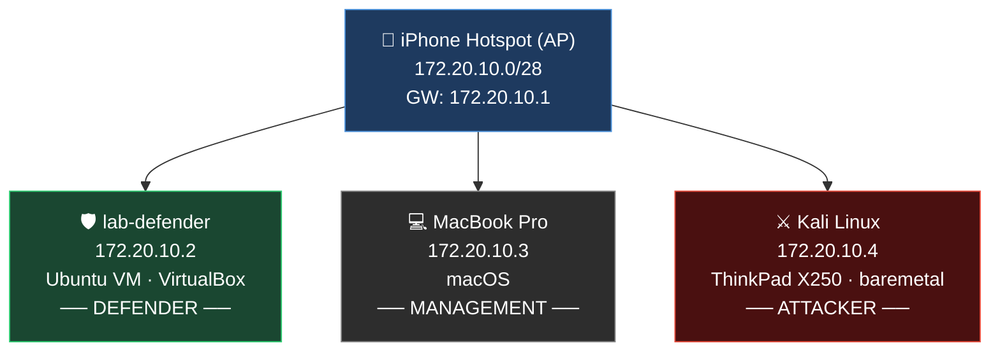
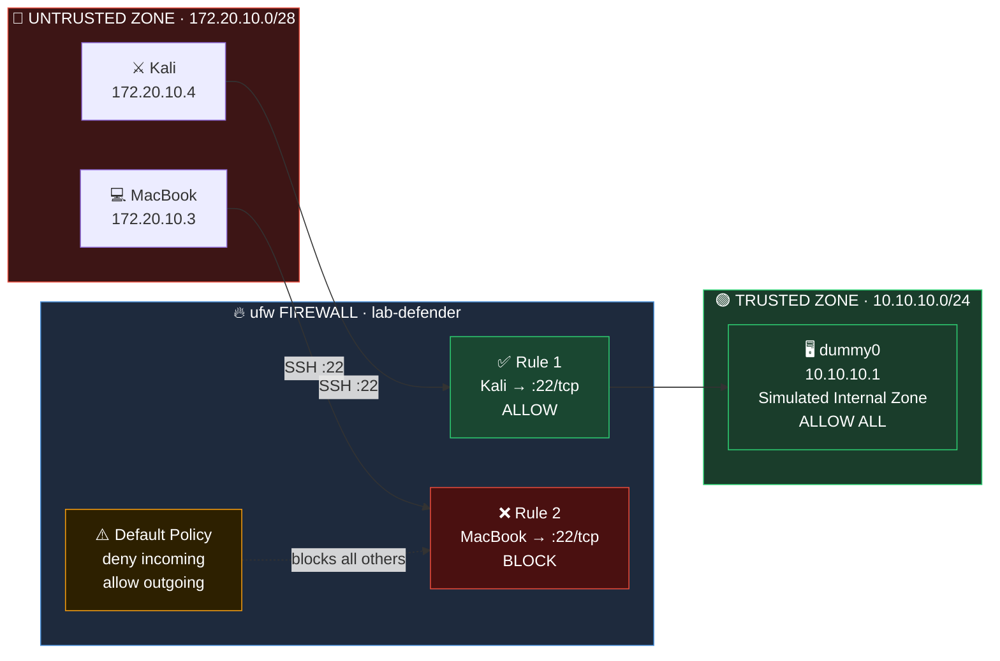
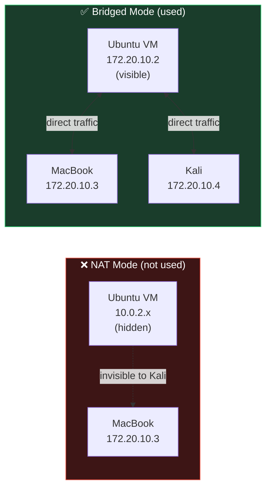

# 🗺️ Lab Topology

> **Lab:** 03 — Firewall & Segmentation  
> **Date:** 2026-03-20  
> **Network:** iPhone Hotspot · `172.20.10.0/28`

---

## 🌐 Physical Network Diagram

---

## 🔥 Firewall Zone Architecture

---

## 📋 Device Inventory

| # | Hostname | IP Address | OS | Role |
|---|---|---|---|---|
| 🛡️ | `lab-defender` | `172.20.10.2` | Ubuntu (VirtualBox) | Defender / Firewall host |
| 💻 | `MacBook-Pro-von-Ersin` | `172.20.10.3` | macOS | Management / Documentation |
| ⚔️ | `kali` | `172.20.10.4` | Kali Linux 6.x | Attacker |
| 🔵 | `dummy0` | `10.10.10.1` | — | Trusted zone (virtual) |

---

## 📡 Network Parameters

| Parameter | Value |
|---|---|
| Subnet | `172.20.10.0/28` |
| Subnet Mask | `255.255.255.240` |
| Usable Hosts | 14 |
| Broadcast | `172.20.10.15` |
| Gateway | `172.20.10.1` |

> **Why /28?** iPhone hotspot assigns a `/28` by default — only 14 usable addresses. Sufficient for this 3-device lab.

---

## ⚙️ VirtualBox Bridged Mode

> Bridged Adapter places the VM directly on the hotspot network. The VM gets its own DHCP lease — fully reachable by Kali for real firewall testing.
